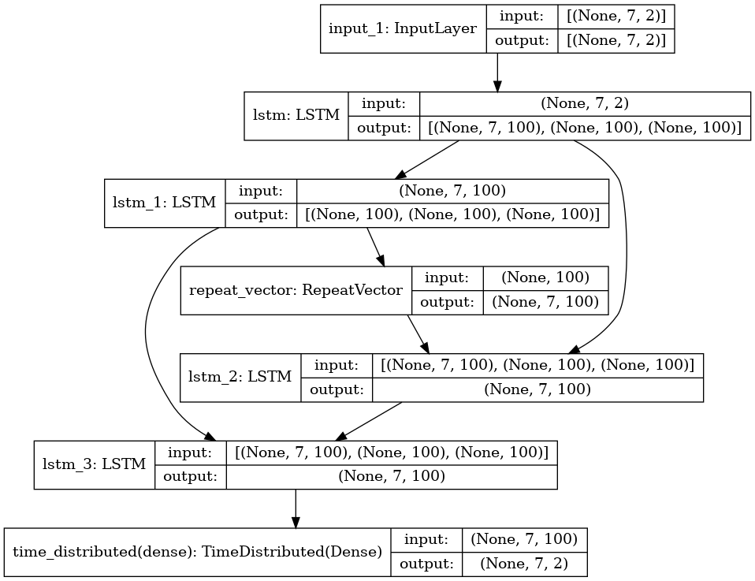

# DSAI_HW1   Electricity Forecasting

<p align="center">
  
</p>

本作業所使用的 ``time series`` 模型為 **LSTM** ，並以前七天的資料來當作每次預測的依據，去預測接下來後七天的資料。最終目標是預測 **20210323** 到 **20210329** 為期七天的備轉容量數值。評估模型的表現是以 ``RMSE`` 為標準，而本模型的RMSE表現結果約為 **126.46** 。後面也會視覺化Validation的情況，我們可以根據線段的重疊度來大概判斷模型的準確率。

# Environment
  - **Python 3.8.3**
  - **Ubuntu 20.04.2 LTS**

# Requirement
requirements.txt目前還是手刻，若有python版本和lib版本相衝或不相容，還請自行解決。

  - **pandas == 1.2.3**
  - **keras == 2.4.3**
  - **matplotlib == 3.2.2**
  - **numpy == 1.19.5**
  - **sklearn == 0.24.1**
  - **pydot == 1.4.2**
  - **graphviz == 0.16**

# Build
Install requirement.txt
```
pip3 install -r requirements.txt
```

Run app.py. Input and Output Path are defined in the app.py.
```
python3 app.py
```
強烈建議直接執行ipynb檔案來直接看我們在各個區塊的輸出結果。

## Input data
Input的data為政府資料開放平臺上的[台灣電力公司_過去電力供需資訊.csv](https://data.gov.tw/dataset/19995)。在這份資料中有共有**397**個 ``entries`` 和 **71** 個 ``features``。而本模型只使用的features為 ``備轉容量 (MW)`` 與 ``備轉容量率（%)`` 。且 ``traning data`` 與 ``validation data`` 以比例為**9:1**做切割。
  <p align='center'>
    
  </p>

  <p align='center'>
    
  </p>

## Scaling
為了加快模型收斂找到最佳參數組合，這裡使用``MinMaxScaler``把資料重新scaling成 **-1** 至 **1** 之間。

## Model Structure
  <p align='center'>
    
  </p>
  
  <p align='center'>
    
  </p>

## Training
``epochs``設定為**50**，最後``loss``約位於**0.04**左右：
 <p align='center'>
  
 </p>
 
 <p align='center'>
  
 </p>
       
預測結果與validation data之對照圖：

粉線為prediction，黑線為validation


## Prediction Result

以此模型進行2021/03/23~2021/03/29的備載容量預測結果。

  <p align='center'>
    
  </p>

## Note

## Keywords
  - **Time Series**
  - **Forecasting**
  - **LSTM**
  - **RNN**
  - **Multivariables**
  - **SARIMA Model**
  - **Holt-Winter Model**

## References
  - [Dropbox Homework Description](shorturl.at/nozNX)
  - https://www.analyticsvidhya.com/blog/2020/10/multivariate-multi-step-time-series-forecasting-using-stacked-lstm-sequence-to-sequence-autoencoder-in-tensorflow-2-0-keras/
  - https://medium.datadriveninvestor.com/multivariate-time-series-using-rnn-with-keras-7f78f4488679

